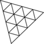

  

<!-- h2 begin  -->  

<h2 align="center"><b>Hello </b>

</h2>
<!--h2 End-->
    
<!--h3 begin-->    
<h3>I'm Mbiamou Richy</h3>
<!--End h3-->
    
<!--Liste i'm frontend dev -->    
* 🌴 I am a <b>Frontend Developer</b>
* 🌳 I’m currently learning TailwindCSS and Three.JS!
* 🐾 I’m looking to network and make friends here!
* 🌊 2023 Goals: Learn VueJS and Contribute to Open Source Projects
* ☕ Interest: Science, Physic, Coffee, and Coding.
* :octocat: Hobbies: Sleeping, Reading, Anime, Manga, Gaming, and Code.

<!--End liste-->
 <!-- contributors--> 
 

<h2 align="center"><b>Contributions</b> 
 
</h2>

<h2></h2>
 <!-- END CONTIBUTORS-->   
    
<!------------------follow me------------------->    

<h2 align="center"><b>Follow me</b>

</h2>
 

   
      
       
 

 <h2></h2>

 <!--End follow me-->
    
<!-- Languages-->    

<h2 align="center"><b>Languages and Tools</b>

</h2>

               
    
    
      
    
   
   

<!--ENd languages-->
    
  

